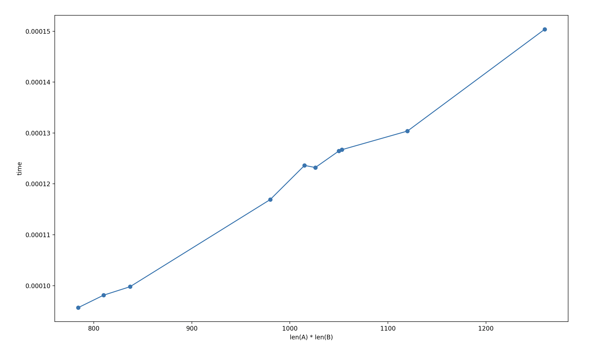

## Name and ID
**Name:** Linwei Zhang
**UFID:** 55022278

## Instruction to Run
**How to Run:**                                                                                                                                                                                                                                                                      
python3 src/main.py \<input\_file\>                                                                           
**Example**:  
python3 src/main.py data/input1.in                                                                         
                                                                                         
Generate the runtime plot (requires matplotlib):                                                                                                                                          
python3 src/PlotTime.py 

## Question 1
    
The x-axis is the length of A times the length of B. The y-axis is the runtime in seconds. Thus the resulting graph is linear.

## Question 2
Define OPT\[i\]\[j\] to be the max value of a common subsequence using A\[1…i\] and B\[1…j\]  
**Base case:**   
OPT\[i\]\[0\] \= 0, OPT\[0\]\[j\] \= 0  
**Recurrence equation:**   
If A\[i\] \== B\[j\], then OPT\[i\]\[j\] \= max{OPT\[i-1\]\[j-1\]+val(A\[i\]), OPT\[i-1\]\[j\], OPT\[i\]\[j-1\]}  
Else, OPT\[i\]\[j\] \= max{OPT\[i-1\]\[j\], OPT\[i\]\[j-1\]}  
**Explanation:**  
This is correct because the algorithm can be divided into two cases. Case 1 is when A\[i\] \== B\[j\], ie A\[i\] and B\[j\] matches. Then we can decide whether to add this pair into the subsequence (OPT\[i-1\]\[j-1\]+val(A\[i\])), or skip (OPT\[i-1\]\[j\] or OPT\[i\]\[j-1\]) by choosing the max of all three scenarios. Case 2 is when A\[i\] \!= B\[j\], then we just need to choose to skip. We can either skip A\[i\] or skip B\[j\], so we choose the max of the two.

## Question 3
The runtime is O(n\*m) where n is the length of A and m is the length of B. This is because we have created a 2-d array of the size n\*m, and we looped over all elements of this n by m table.

